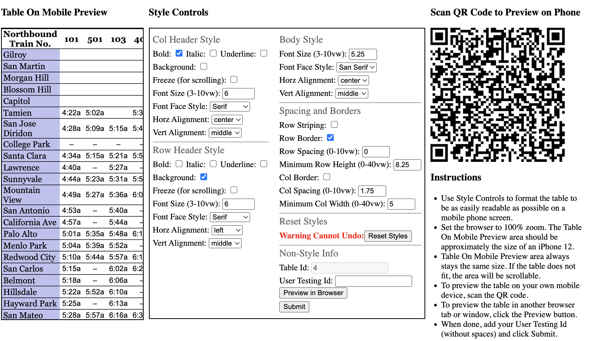
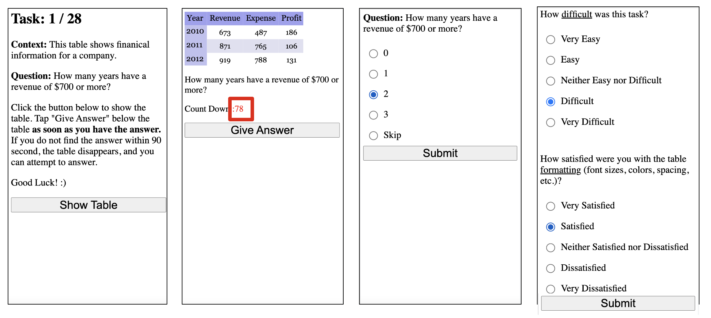
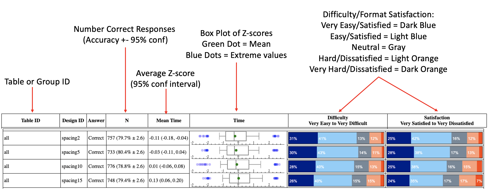

# Web Table Formatting Affects Reading Speed on Mobile Devices

This repo contains the code and data collected for our WWW '23 paper, [Web Table Formatting Affects Reading Speed on Mobile Devices](https://dl.acm.org/doi/abs/10.1145/3543507.3583506).
This includes tools for designing table formats and performing our data collection and analysis.

# Code Documentation

This code is composed of two parts: (1) a node JS web server and (2) Python3 scripts for offline data analysis.

## Web Server Documentation
To run the web server (default port is 3002) on localhost, run
```
node server.js
```
You might need to install some node modules, which you can do with `npm install fs.promises express`.
The served files live in the `public` directory.


### Designing Tables



<http://localhost:3002/style_table.html?table_id=1> is the endpoint for our table design tool.  
The `table_id` query param can be set to reference any HTML table file in the `public/tables` directory, which is currently populated with the tables 1-28 used in our study.
The tool itself has instructions for how to use the tool, but when the table design is saved, it writes a JSON file to `style_out` directory.

### Viewing Table Designs

There are 2 basic endpoints for viewing the table designs saved in the `style_out` directory:
- <http://localhost:3002/view_result?worker_id=designer1&table_id=1> 
- <http://localhost:3002/view_result2?worker_id=designer1&table_id=1> 
The only difference is whether the resulting table is viewed within an iframe sized to mimic a mobile device size (`view_result2`) or not (`view_result`).
The query params are used to look up a saved result. 
The required `worker_id` query param refers to the `User Id` field used when saving a design on the `style_table.html` tool.
`table_id` is required as well.
If the `date` query param is provided, then a result saved on that particular datetime (represented as integer epoch offset, e.g., `1636392296340`) is retrieved.
If `date` is omitted, then the most recent result matching `worker_id` and `table_id` is used.

Under the hood, both of these endpoints redirect to <http://localhost:3002/view_table.html> and <http://localhost:3002/view_table2.html> with the loaded style parameters encoded as query params.

The repo contains the designs produced by 5 of our Expert Designers (anonymized with `worker_id = designer[1-5]`) for tables with id `1-14`.
It also includes style files used in the quantitative readability study for tables ids `1-28`.
The (faux) `worker_id`s of these files include `spacing[2,5,10,15]`, `plain`, `colborders`, `rowborders`, `striped`, `bad`, `colfreeze`, `rowfreeze`, `bothfreeze`.

### Readability Study



<http://localhost:3002/readability.html?version=v4> is the endpoint for users to participate in the readability study.
If you visit this page on a non-mobile device, it will not let you proceed and will offer you a QR code to open the study on your phone.
Study responses are put into the `readability_results` directory as several individual JSON files so that if the participant does not complete the study, we have all responses they did complete.

### Viewing Readability Tasks

<http://localhost:3002/view_task.html?task=task_v2> looks for a `task_config` file in the `data_for_viewing` directory with a filename equal to the `task` query parameter (with a `.json` extension).
The `task_config` files normally live in the `task_versions/v[1-4]/config.json` files, but they have been copied to the `data_for_viewing` directory so that `view_task.html` can access them.
This page displays all tasks, which are composed of question, context, answer choices, answer, and table format variations.

### Viewing Readability Study Results



After running the python analysis code on the readability study responses, the code produces a pair of data objects in the `data_for_viewing` directory.
One data object has the unnormalized task timings and the other has the normalized time z-scores.
This data can be visualized at <http://localhost:3002/view_readability_results.html?results=spacing_zscore_data>.
The `results` selects which data object file is viewed.
Optionally, `pair` can be passed as a query parameter to view pairwise comparisons of the table formats.  E.g., <http://localhost:3002/view_readability_results.html?results=spacing_zscore_data&pair=true>

## Offline Code Documentation

In the `readability/code` directory, there are a number of Python3 and shell scripts.  
The `./do_all.sh` script is the entry point.  
First, open the script and set these script parameters appropriately:
```
name=spacing
task_file=../../task_versions/v2/config.json
input_dir="../study_responses/spacing"
```
The `input_dir` contains the raw responses of the readability study, i.e. `input_dir` should have a subdirectory for every participant who took the study named with the datetime (i.e. session id) when they started the study.
In each of those subdirectories, there should be a few JSON files for each task.
`task_file` is the `task_config` file used for the readability study when the responses were corrected.
`name` you get to choose since it's just used to name filenames for the output files.

First, `do_all.sh` will perform the iterative filtering to remove readability study responses/participants who are outliers. 
Then it will aggregate the data into data objects (both normalized and unnormalized task timings) and put them in the `code/out` and `data_for_viewing` directories.
A CSV file, where each row is the data for a participant (including their survey responses) is also put in the `code/out` directory.
It creates a file with the mean/std used per table for the z-score transformation in `code/data_files`.
It also puts a file with the computed outlier ranges in that same directory.
Logging and Error files are recorded in the `data_files` directory so you can see what is going on with the script.


# Citation 

If you find this code or data helpful in your work, please consider citing our paper:

```
@inproceedings{10.1145/3543507.3583506,
author = {Tensmeyer, Christopher and Bylinski, Zoya and Cai, Tianyuan and Miller, Dave and Nenkova, Ani and Niklaus, Aleena and Wallace, Shaun},
title = {Web Table Formatting Affects Readability on Mobile Devices},
year = {2023},
isbn = {9781450394161},
publisher = {Association for Computing Machinery},
address = {New York, NY, USA},
url = {https://doi.org/10.1145/3543507.3583506},
doi = {10.1145/3543507.3583506},
booktitle = {Proceedings of the ACM Web Conference 2023},
pages = {1334–1344},
numpages = {11},
keywords = {mobile device, quantitative study, reading, web tables},
location = {Austin, TX, USA},
series = {WWW '23}
}
```


